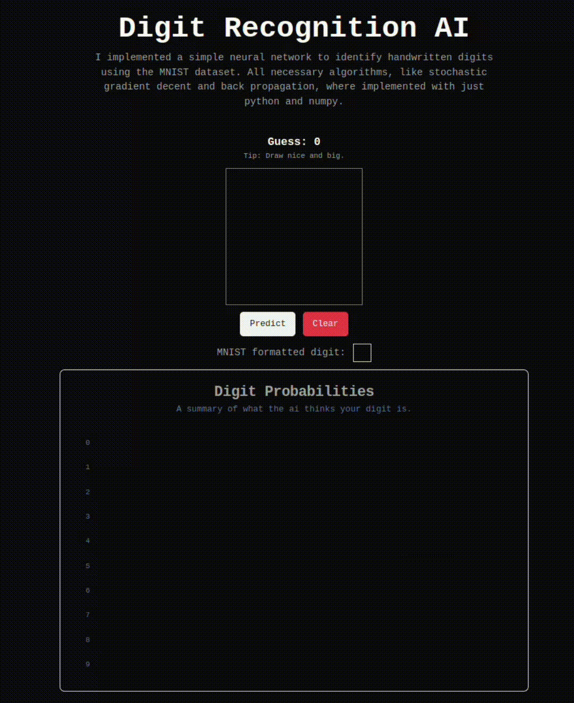

# Digit AI

I implemented a simple neural network to identify handwritten digits using the MNIST dataset. All neccessary algorithms, like stochastic gradient decent and back propagation, were implemented from scratch.

I achieved 96% accuracy on the MNIST dataset. The web app might perform slightly worse given that the data is not cleaned to the same standard as the dataset.

The webapp centers the digit using a bounding box before sending off to the api which significantly improves accuracy.

### Implementation

I used python and numpy for the neural network. Tensorflow is still a requirement in this project to make it easier to import the dataset. This neural net is accessible via an api I implemented using flask. Note that training must take first before anything, which can be done by calling the "/api/train" endpoint once the sever is booted up (this will take around 5 mins).

I also made a simple web app using next.js to see the ai in action.

### Parameters

1. Hidden layers: 1 with 100 neurons
2. Epochs: 30
3. Mini batch size: 10
4. Learning rate: 3.0
5. Cost function: Quadratic

### Preview

